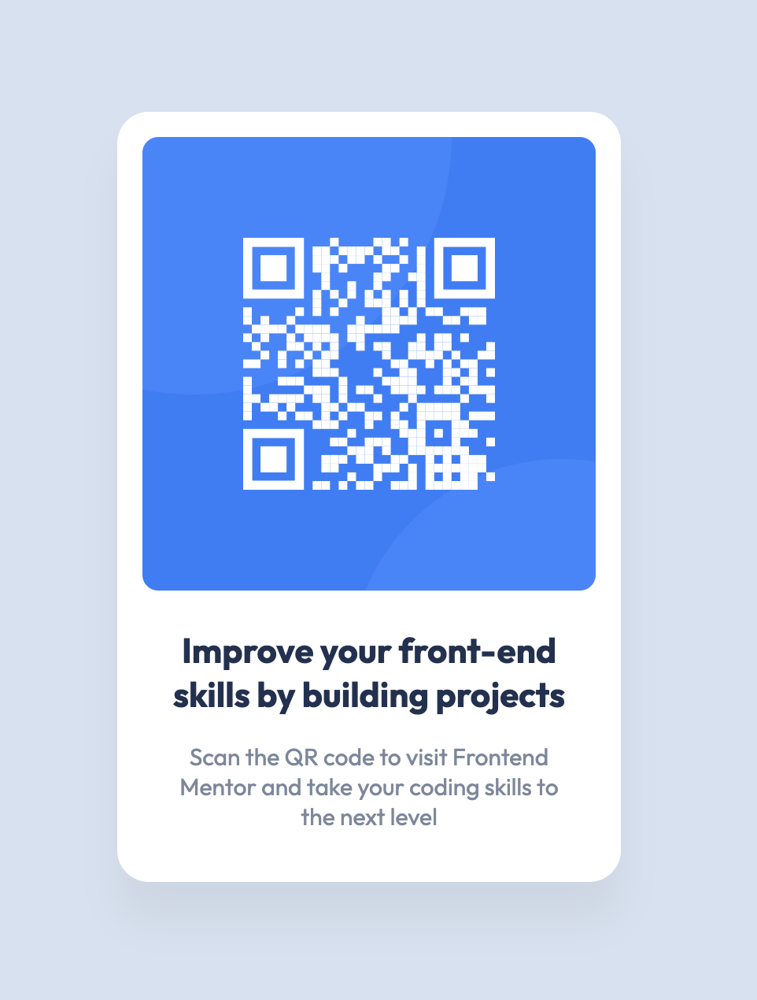

# Frontend Mentor - QR code component solution

This is a solution to the [QR code component challenge on Frontend Mentor](https://www.frontendmentor.io/challenges/qr-code-component-iux_sIO_H). Frontend Mentor challenges help you improve your coding skills by building realistic projects.

## Table of contents

- [Overview](#overview)
  - [Screenshot](#screenshot)
  - [Links](#links)
- [My process](#my-process)
  - [Built with](#built-with)
  - [What I learned](#what-i-learned)
  - [Useful resources](#useful-resources)
- [Author](#author)

**Note: Delete this note and update the table of contents based on what sections you keep.**

## Overview

### Screenshot

Screenshot of solution

### Links

- Solution URL: [https://www.frontendmentor.io/solutions/qr-code-component-built-with-parcel-9iittuOOZ](https://www.frontendmentor.io/solutions/qr-code-component-built-with-parcel-9iittuOOZ)
- Live Site URL: [https://jwa-qr-code-component.netlify.app/](https://jwa-qr-code-component.netlify.app/)

## My process

### Built with

- [SCSS](https://sass-lang.com/) - CSS extension
- [Parcel](https://parceljs.org/) - build tool

### What I learned

This was my first time using Parcel in a project. I felt it was a really easy experience and I'm looking forward to making more complex projects with it.

### Useful resources

- [Parcel documentation](https://parceljs.org/docs/)
- [SCSS documentation](https://sass-lang.com/documentation)

## Author

- GitHub - [james-work-account](https://github.com/james-work-account)
- Frontend Mentor - [@james-work-account](https://www.frontendmentor.io/profile/james-work-account)
